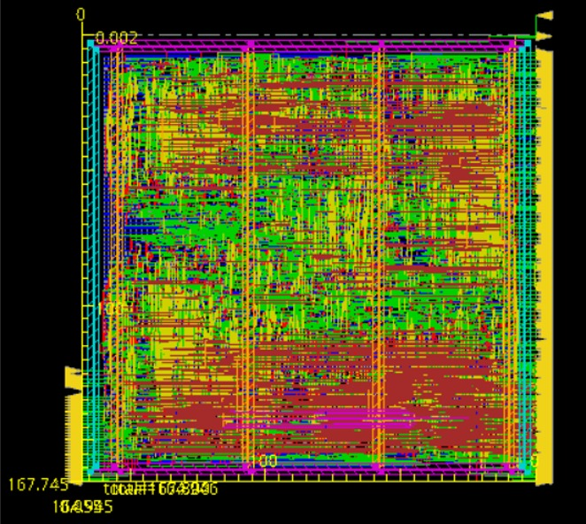
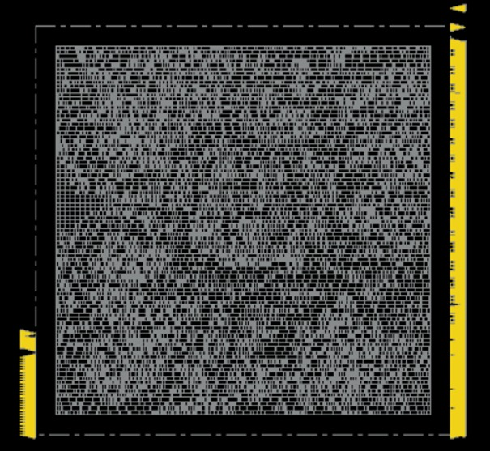

# 4×4 DNN Hardware Accelerator ASIC

SystemVerilog implementation of a pipelined 4×4 dot-product accelerator for neural network workloads, taken through an RTL-to-GDSII ASIC implementation flow using Cadence Genus and Cadence Innovus in a 45 nm technology node.

---

## Overview

This project explores the implementation of a hardware accelerator for neural network computation using a pipelined multiply-accumulate (MAC) architecture. The design performs dot-product operations commonly used in fully connected neural network layers and was developed as an individual project.

The accelerator was designed in SystemVerilog, functionally verified in ModelSim, synthesized using Cadence Genus, physically implemented using Cadence Innovus, and validated through post-layout gate-level simulation.

---

## Design Flow

```text
RTL Design (SystemVerilog)
          │
          ▼
Functional Verification
(ModelSim)
          │
          ▼
Logic Synthesis
(Cadence Genus)
          │
          ▼
Place & Route
(Cadence Innovus)
          │
          ▼
Clock Tree Synthesis
          │
          ▼
Post-Layout Timing Analysis
          │
          ▼
Gate-Level Simulation
(ModelSim)
```

---

## Physical Design Views

| Routed Layout                         | Placement View                         |
| ------------------------------------- | -------------------------------------- |
|  |  |

### Clock Tree Synthesis


---

## Architecture

The accelerator implements a pipelined multiply-accumulate datapath optimized for matrix and vector operations used in neural network inference. Internal memories store operands and intermediate results while control logic coordinates computation, memory accesses, and result generation.

---

## Key Features

* Pipelined MAC-based architecture
* 4×4 dot-product computation engine
* RTL implementation in SystemVerilog
* Functional verification using ModelSim
* ASIC synthesis using Cadence Genus
* Physical design using Cadence Innovus
* Clock tree synthesis and timing closure
* Post-layout gate-level verification

---

## Results

| Metric              | Value          |
| ------------------- | -------------- |
| Technology Node     | 45 nm          |
| RTL Language        | SystemVerilog  |
| Post-Synthesis Area | 15,803.478 μm² |
| Post-Layout Area    | 27,669.510 μm² |
| Setup Slack         | 447 ps         |
| Hold Slack          | 23 ps          |
| Verification Errors | 0              |

---

## Verification

### RTL Simulation

* Functional verification using ModelSim
* MAC operation validation
* Memory write verification
* Memory read verification
* Control signal timing verification

### Post-Layout Simulation

* Gate-level simulation using post-layout netlists
* Timing-aware verification
* Clock tree validation
* Delay analysis
* Glitch observation and timing characterization

All verification test cases completed successfully with zero functional errors.

---

## Repository Structure

```text
asic-dnn-accelerator-4x4/
├── docs/
│   └── images/
├── rtl/
├── tb/
├── reports/
├── results/
│   ├── rtl_simulation/
│   ├── post_layout_simulation/
│   └── layout/
├── scripts/
│   ├── genus/
│   └── innovus/
└── README.md
```

---

## Tools Used

* SystemVerilog
* ModelSim
* Cadence Genus
* Cadence Innovus

---

## Learning Outcomes

* Hardware accelerator design
* Pipelined digital architectures
* ASIC implementation flow
* Logic synthesis
* Place and route
* Clock tree synthesis
* Static timing analysis
* Gate-level verification
* Physical design considerations
